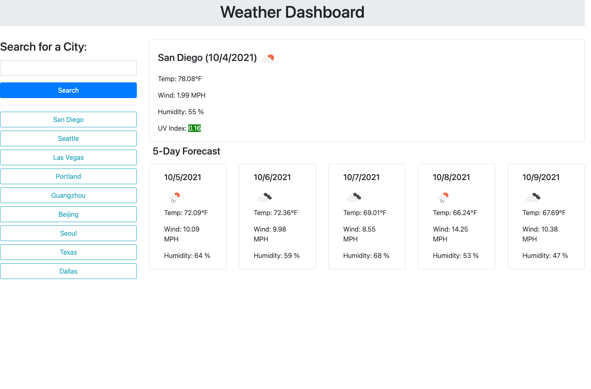

# Wather Dashboard ☀️| HTML, CSS, JavaScript & jQuery 🌡️

## 🌟 Description
This project is to build a weather dashboard that will run in the browser and feature dynamically updated HTML and CSS.

## 🌟 User Story
AS A traveler,
I WANT to see the weather outlook for multiple cities,
SO THAT I can plan a trip accordingly. 

## 🌟 Acceptance Criteria
### GIVEN a weather dashboard with form inputs
- WHEN I search for a city,
THEN I am presented with current and future conditions for that city and that city is added to the search history
- WHEN I view current weather conditions for that city,
THEN I am presented with the city name, the date, an icon representation of weather conditions, the temperature, the humidity, the wind speed, and the UV index
- WHEN I view the UV index,
THEN I am presented with a color that indicates whether the conditions are favorable, moderate, high, very high or extreme 
- WHEN I view future weather conditions for that city,
THEN I am presented with a 5-day forecast that displays the date, an icon representation of weather conditions, the temperature, the wind speed, and the humidity
- WHEN I click on a city in the search history,
THEN I am again presented with current and future conditions for that city

## 🌟 Screenshot of the Wearhter Dashboard web application

## 🌟 Deployed link to the app

https://elenaliu0415.github.io/weather-dashboard/
